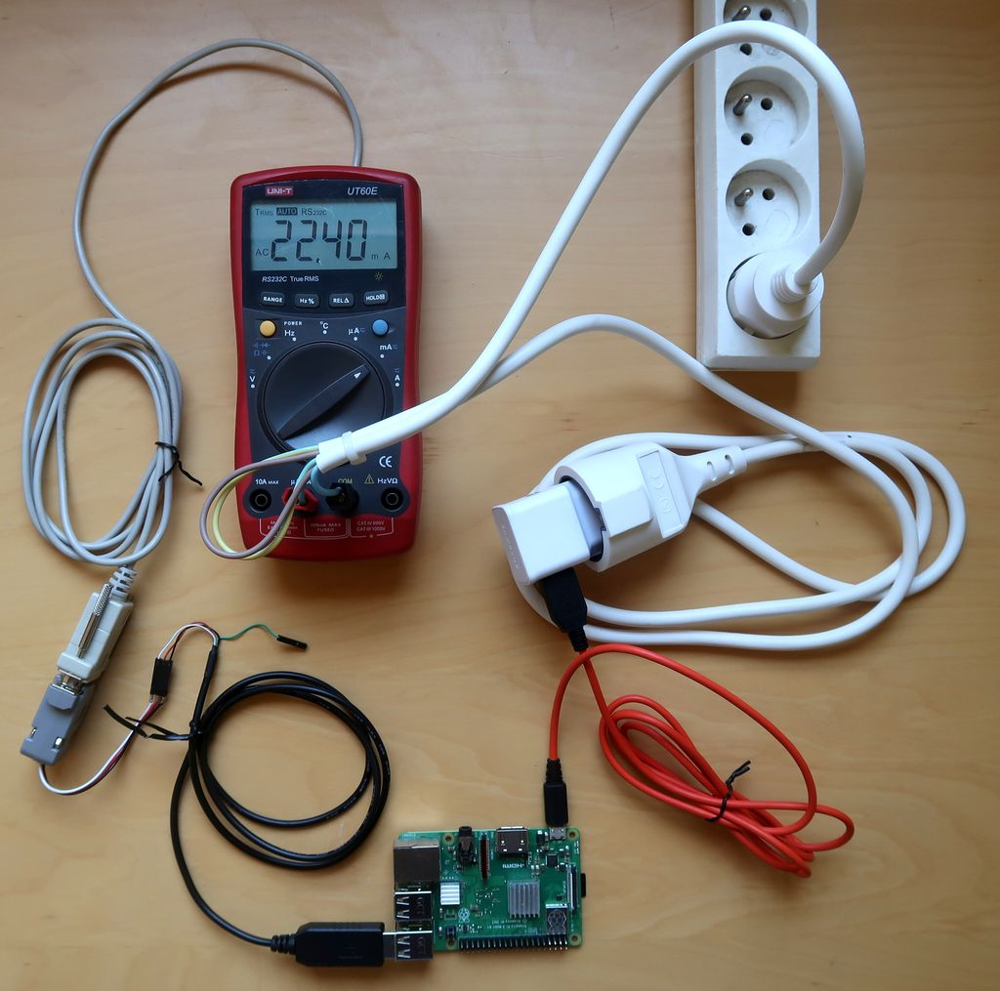
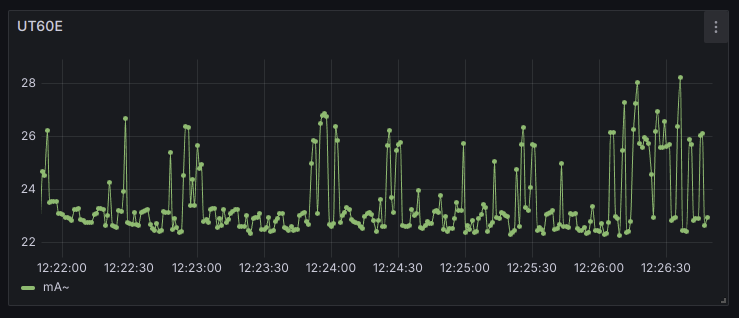
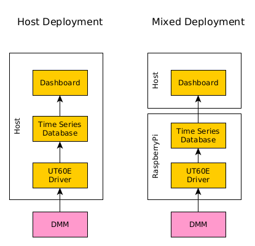
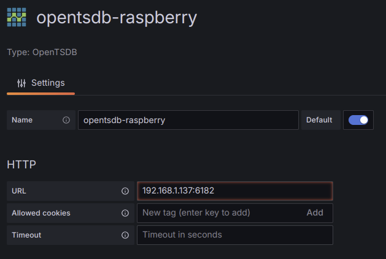
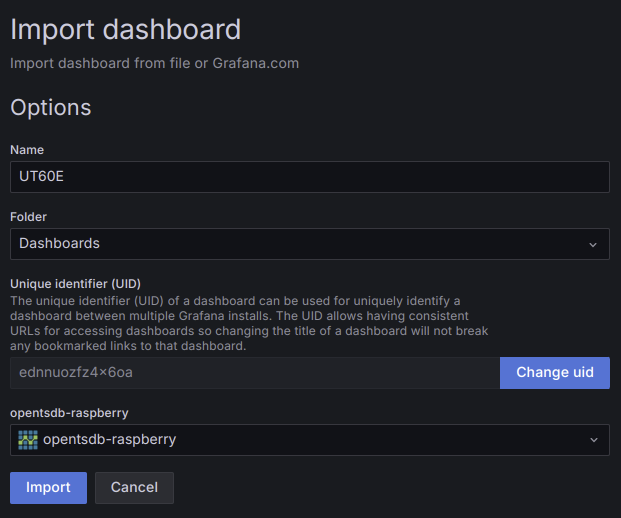

# UT60E Dashboard

This project is a quick yet practical PoC that verifies usability of [crystal](https://crystal-lang.org/) on aarch64 platform. It is an implementation of a driver that reads measurements from Uni-T UT60E multimeter and stores it in a [time series database](https://en.wikipedia.org/wiki/Time_series_database) from where they can be obtained for further processing or visualization.



Raspberry Pi on the picture measures current consumption of itself.



## Application

Proposed application consists of three software components:

- `ut60e` - Interface to the multimeter. Implemented in crystal and using only its standard library.
- [ticktock](https://github.com/ytyou/ticktock.git) - Efficient database implemented in C++, compatible with OpenTSDB.
- [Grafana](https://grafana.com/grafana/) - open source platform acting as a dashboard.

## Deployment Options

All the three software components are available for aarch64 and x86_64 platforms. This allows for many deployment options, where the following two seem the most practical:



- Host Deployment - It is the simplies option which can be put together quickly. All we need is the host computer and DMM. It can be used for many short at-hoc measurements. It was also usefull for development of `ut60e.cr`.
- Mixed Deployment - It is dedicated to long-term measurements where we don't want the host computer to keep working all the time. While Raspberry Pi can connect to the host over WiFi, this option is also suitable for short-range remote measurements.

Remaining part of this document assumes using **Mixed Deployment**.

## Hardware

For the purpose of this project following hardware has been used: 

- Host computer with Ubuntu Linux
- Raspberry Pi 3 Model B+
- Uni-T UT60E with original RS232 cable
- RS232-to-USB converter

## Configuration

1. Compile and install ticktock DB in Raspberry Pi

```sh
git clone https://github.com/ytyou/ticktock.git
cd ticktock
make -f Makefile.ubuntu
sudo cp bin/tt /usr/bin/

# install files from this repo and start database
sudo cp ticktock.service /etc/systemd/system
sudo cp ticktock.conf /etc/systemd/system
sudo systemctl start ticktock
```

Note that precompiled binaries of ticktock are available. As per version 0.20.0, I did't find them working on aarch64 though.

2. Cross-compile and install `ut60e.cr` driver
- Install crystal on the host side as described on their [webpage](https://crystal-lang.org/install/)

- Cross-compile `ut60e.cr` on the host side:
  
  ```sh
  crystal build ut60e.cr --cross-compile --target "aarch64-linux-gnu-"
  scp ut60e.o pi@raspberry:~
  scp ut60e.service pi@raspberry:~
  ```

- Build `ut60e.o` in Raspberry Pi:
  
  ```sh
  # install required libraries
  sudo apt-get install -y clang libssl-dev libpcre2-dev libgc-dev libevent-dev zlib1g-dev
  
  # build (actual command is provided by crystal compiler in the previous step)
  cc ut60e.o -o ut60e  -rdynamic -L/usr/bin/../lib/crystal -lz \
  `command -v pkg-config > /dev/null && pkg-config --libs --silence-errors libssl || printf %s '-lssl -lcrypto'` \
  `command -v pkg-config > /dev/null && pkg-config --libs --silence-errors libcrypto || printf %s '-lcrypto'` \
  -lpcre2-8 -lgc -lpthread -levent -lrt -lpthread -ldl
  
  # install and start the driver
  sudo mv ut60e /usr/bin/
  sudo mv ut60e.service /etc/systemd/system
  sudo systemctl start ut60e
  ```
3. Launch and configure Grafana dashboard

Perhaps the easiest way of launching grafana is through [Docker](https://www.docker.com/) (assuming that it is already installed).

```sh
docker run -d -p 3000:3000 --name=grafana grafana/grafana
```

After initial configuration, create new OpenTSDB source and provide IP of your Raspberry PI:



Import dashboard from `ut60e-dashboard.json`. It supports all the modes/units provided by the multimeter:


